# ARM 프로세서의 구조

## 1. Pipeline
### 1.1 ARM(ARM9TDMI) 5단 Pipeline 구조

- FETCH : 코드 읽어들임
- DECODE : 코드 해독
- EXECUTE : 계산 (명령어 동작 실행)
- MEMORY : 메모리 접근
- WRITE : 레지스터에 값 저장

### 1.2 이상적인 Pipeline 동작


- LDR R4, [R5] : R5에 담긴 값을 읽어 R4에 저장
    - [ ] : 레지스터 주소 내에 저장된 값
- 매 클럭 사이클마다 하나의 명령어 실행
- LDR 명령의 Destination 레지스터가 다음 명령에서 바로 사용되면 안된다.

### 1.3 LDR 명령과 Interlock 사이클
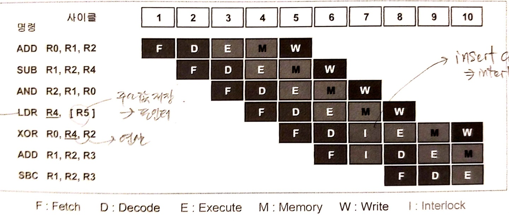
- LDR 명령 실행 후 destination 레지스터인 R4가 바로 XOR 연산에 사용 됨
- 이 때 LDR 명령 실행 후 아직 읽어온 값이 레지스터에 쓰여지지 않고 memory access하는 과정에서 바로 XOR 연산 명령어를 실행해서는 안된다.
- **Interlock 사이클**을 넣어 주어 연산 명령 실행을 하나의 사이클을 늦춰주어 원활한 명령 실행

### 1.4 Branch 명령과 Pipeline 동작
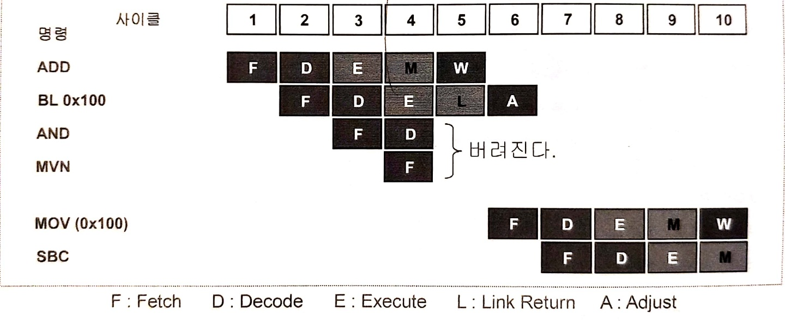
- 함수 등을 실행하기 위해 Branch 명령(BL)이 실행되면 Fetch한 명령을 모두 버리고 분기된다. => Pipeline 깨짐
- <u>분기되는 시점의 PC는 MVN 명령어 실행의 주소를 가리킨다.</u>
- ARM11에서는 Branch prediction을 지원하여 Pipeline 깨져서 성능하락하는 것을 방지한다.

# ARM 프로세서의 명령어
- 32 비트 ARM 명령어
    - Load/Store와 같은 메모리 참조 명령이나 Branch 명령에서는 모두 상대주소(Indirect Address)방식을 사용한다.
    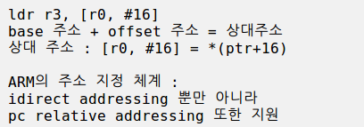
    - Immediat 상수는 32 비트 명령어 내에 표시된다. (32 비트 내의 값)
    - <u>모든 ARM 명령어는 조건부 실행이 가능하다.</u>
    - Load/Store Architecture 사용 (RISC 프로세서의 특징)
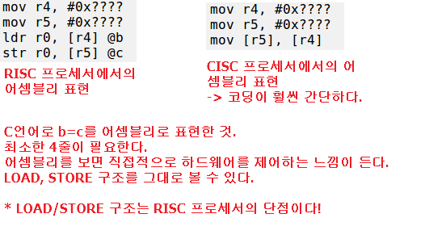
- 16 비트 Thumb 명령어
    - 8비트나 16비트와 같은 좁은 메모리 인터페이스에서 ARM 명령을 수행할 때 보다 성능이 우수
    - 단점 : 조건부 실행이 안된다. Immediate 상수 값이 표현 범위가 적다.

> Un-alingned access 비지원 테스트

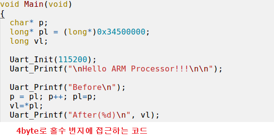
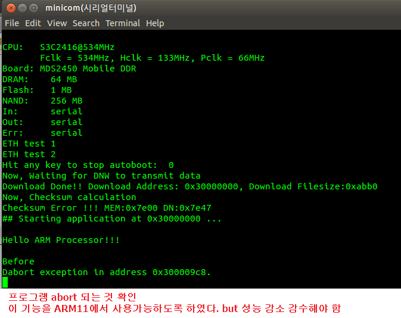
- 결과 : Abort 발생하여 소프트웨어 실행이 정지된다.

## 1. 조건부 실행
- ARM에서 모든 명령을 조건에 따라 실행 여부 결정 가능
- ARM의 최대 장점중 하나
- 조건부 실행 장점 : Branch 명령의 사용을 줄이므로서 Pipeline이 깨지고 새로운 명령을 읽어오는 사이클의 낭비를 줄일 수 있다.

### 1.1 조건부 실행 방법
- 조건에 따라 명령어를 실행하도록 하기위해서 조건을 접미사로 붙여주면된다.
```c
//조건 없이 실행
ADD r0, r1, r2 // r0 = r1 + r2
//Zero flag가 세트 되어 있을 때만 실행하고자 하는 경우
ADDEQ r0, r1, r2 
```
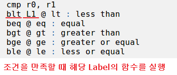
### 1.1.1 조건부 실행으로 비교 조건문 구현 실습
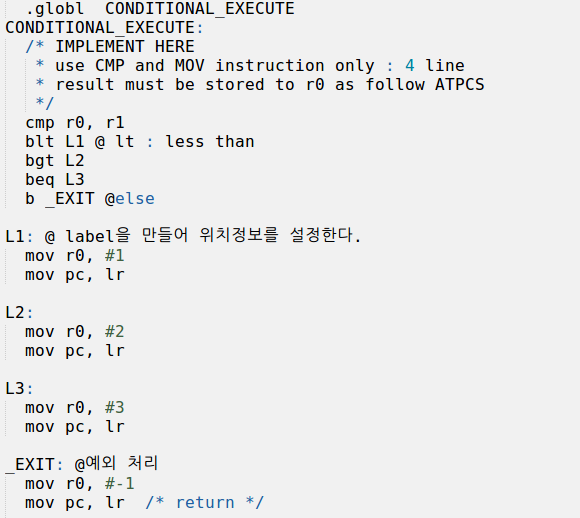

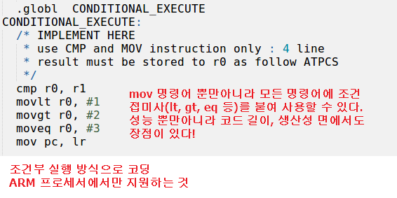
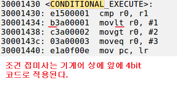

## 2. Branch 명령어
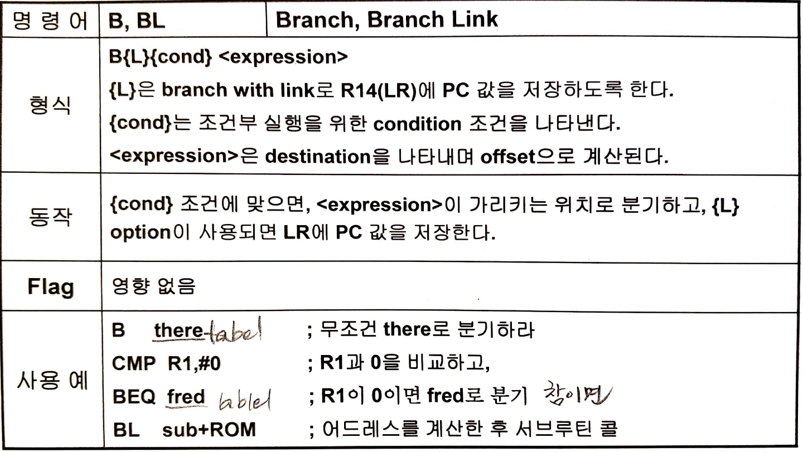

- 분기할 주소 계산
    - PC 값을 기준으로 비트 [23:0]에 해당하는 Offset이 사용된다.
    - 24 비트의 Offset
        - 맨 상위 비트는 +/- sign 비트
        - 나머지 23 비트를 이용하여 <u>2비트 왼쪽으로 shift한 값</u>을 사용
        - 분기 가능한 어드레서 영역 : PC +/- 32MB
### 2.1 Branch 명령어의 분기주소 예시

1. Branch 명령어의 기계어 코드 eb00002b에서 0x2b가 offset을 뜻하는 부분. 실제 offset값은 2비트 왼쪽으로 shift한 값이므로 0x2b << 2 = 0xAC이다.
2. 이것을 확인할 수 있는 또 하나의 방법은 <u>`bl의 분기주소 = PC + offset`</u>으로 확인할 수 있다.
3. 앞선 Pipeline 정상 동작 그림에서 봤듯이 명령어가 실행될 당시의 PC값은 두 사이클 이후에 Fetch되는 명령어의 주소를 갖는다. 따라서 PC = 0x150
4. offset = bl의 분기주소 - PC = 0x1fc - 0x150 = 0xAC 이므로 명령어 코드에 offset 값이 제대로 저장되어있는 것을 확인할 수 있다.

### 2.2 subroutine 구현
- Branch with Link(BL)명령
    1. 다음에 수행할 명령의 위치를 LR에 저장한다.
        = LR = PC-4
    2. PC는 분기를 실행하기 위한 PC + offset 값을 갖는다.
    
- Subroutine에서 Return
    - LR에 저장된 주소를 PC에 옮긴다. (mov pc, lr)

## 3. Data Processing 명령어
- Data Processing 명령은 Register 내에서만 이루어지고 메모리에서 데이터를 읽거나 쓸 떄는 Load 또는 Store 명령을 사용한다.

### 3.1 MVN 명령어
- <u>명령어 코드 구조상 immediate 상수는 8bit 값으로 밖에 표현할 수 없다.</u>

명령 | 동작 | 설명
:---:|:---:|:---:|
MVN | Rd := 0xFFFFFFFF EOR Op2 | Move Negative register

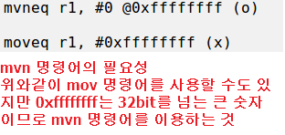
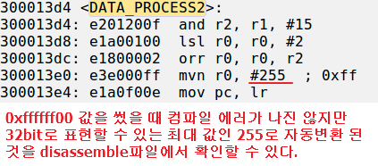

## 4. Operand2와 Barrel Shifter
### 4.1 논리/산술 Shift
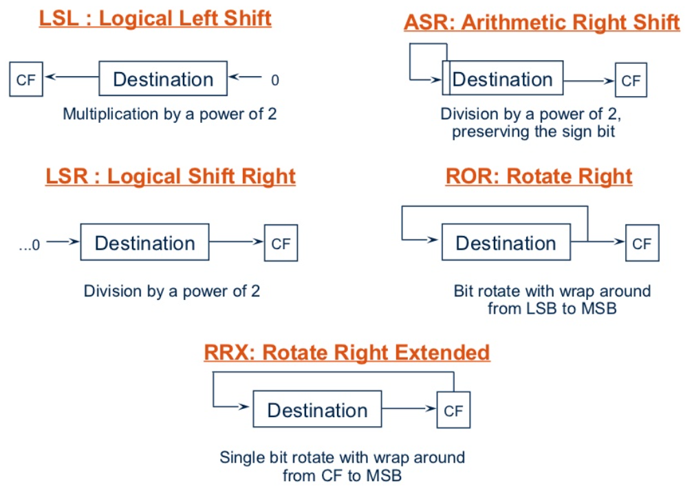

### 4.2 Operand2의 특성
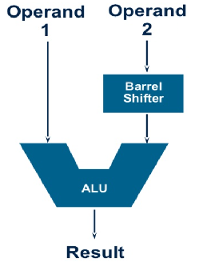
- Operand2는 Barrel shifter를 통해 비트 이동 연산을 거쳐서 ALU 연산에 이용될 수 있다.
- Operand2가 <u>Register인 경우</u>
    - Shift 처리 하여 사용 가능
    - Shift 할 수 있는 값:
        - 5 bit unsigned integer(0~31) 상수
        - 하위 5비트에 shift value를 가진 또 다른 레지스터
- Operand2가 <u>Immediate 상수인 경우</u>
    - 8bit로 표현 가능한 유효 숫자를 rotate하여 만들어 낼 수 있는 32bit의 상수
        - 32 비트 상수를 명시하면 어셈블러가 자동으로 ror연산을 적용하여 변환
        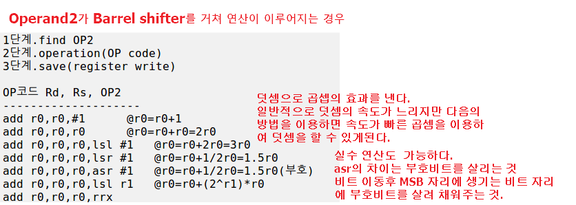

<u>**하지만 홀수개의 비트 이동을 해야할 수 밖에 없을 떈 컴파일 에러**</u>


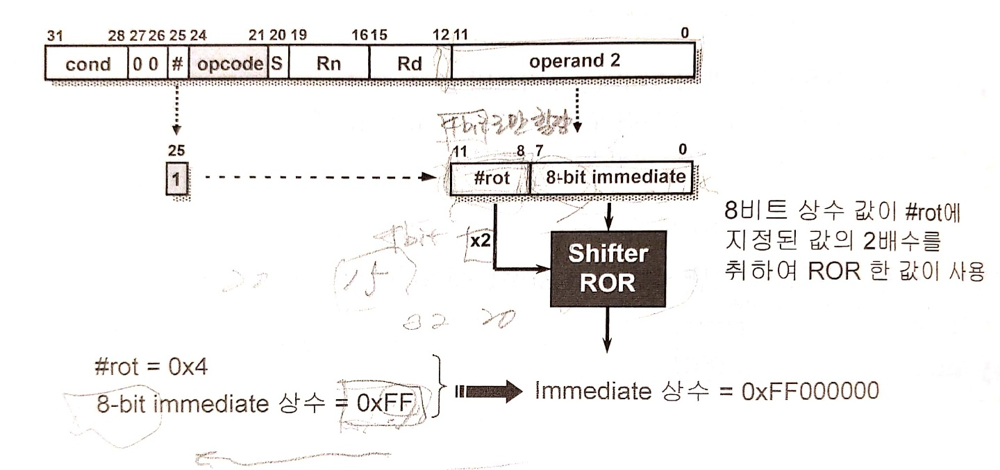
- 명령어 코드의 operand2에 할당된 비트 크기의 제한 상 immediate 상수는 8 비트 범위안으로 밖에 설정할 수 없다.
- 4bit로 구성된 rot의 값을 이용해 rot * 2 만큼의 ROR 연산을 적용하여 32bit 범위의 상수를 구현해 낼 수 있다.
- 이러한 상수표현 방식의 한계는 0xff를 넘어가는 수는 8비트 immediate 상수에다 2의 배수만큼의 비트이동을해서 나타낼 수 없는 경우 즉, <u>홀수 개수만큼의 비트 이동을 해야만 표현할 수 있는 수</u>는 가질 수 없게 된다.

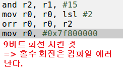
- **해결책** : 다음과 같이 ldr 명령을 통해 그러한 한계 없이 32bit의 상수를 사용할 수 있다.
    1. ldr rd, =constant 명령어 적용

    

    2. ldr 명령 실행에 따라 [pc, #532]에 저장된 값 읽어오기

    

    3. 0x1230이 어셈블러로 생성된 위치를 참조하여 읽어오는 것 확인

    

## 5. PSR Transfer 명령
- CSPR/SPSR의 PSR 레지스터와 ARM 내부 레지스터 R0~R15 사이의 데이터 전송 명령
> CPSR은 중요 레지스터이므로 mov 명령어로 접근이 안된다.(MRS, MSR 명령으로만 가능)
> C로는 구현이 불가하고 어셈블리어로만 실행할 수 있는 동작이므로 레지스터의 안전성이 더욱 보장된다.

- MRS : Move PSR to Register `ex) MRS r0, cpsr` : cpsr을 읽기 명령
- MSR : Move Register to PSR `ex) MSR cpsr, r0` : cpsr에 쓰기 명령

- PSR의 특정 부분의 데이터만 추출하여 전송할 수 있다.
```c
MSR cpsr_f r0
// f부분의 bit만 update, 나머지는 don't care
// f뿐 아니라 s, x, c도 가능
```
- MSR/MRS를 이용한 Interrupt disable/enable

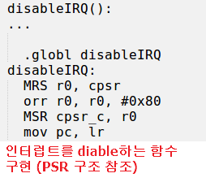


